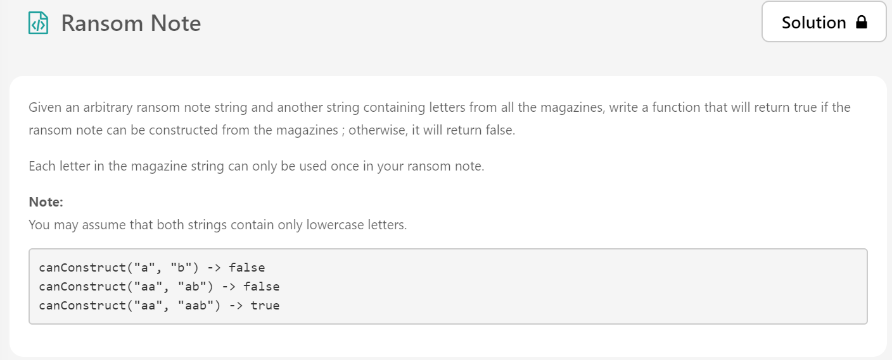
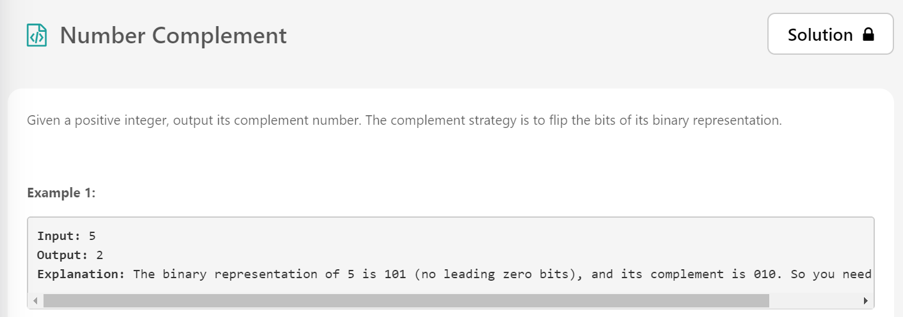
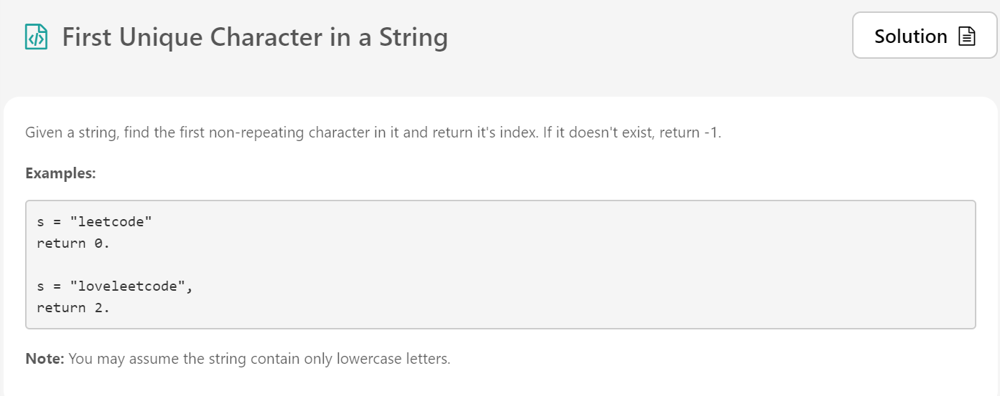
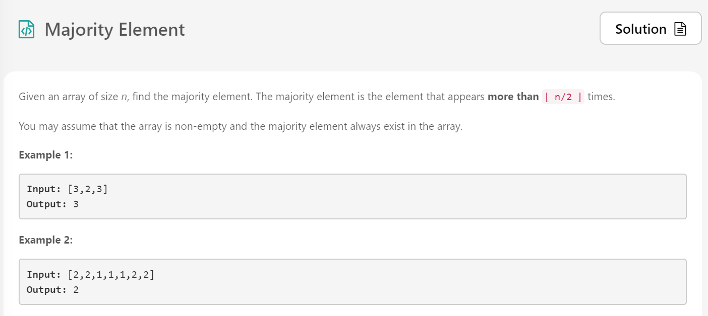

# LeetCode-May-2020
LeetCode's May Challenge of solving a problem a day

# May 1

## Approach

I have perceived the problem as a Search Technique Use Case.
A binary search tree does not store an index of its data elements. Instead, it relies on its implicit structure (left or right of each node) to keep a record of where each element is. The result is insertion and deletion at logarithmic time, or O(log n).
Therefore, I have used Binary Tree to resolve the problem.

This Approach has not provided optimal runtime(32ms)/memory usage(13.7MB).

# May 2

## Approach

I have converted both the strings into a list of characters, and returned the length of the list where characters overlap. This keeps the runtime short but the memory usage is on the higher side due to the creation of multiple lists.

This Approach has provided a runtime higher than 70.46% submissions in Python (26ms) and a memory usage on the higher end(13.6MB).

# May 3

## Approach

I have initialized a dictionary of every character in Ransom, and compared that with the character counts in the Magazine
This Approach has provided an runtime higher than 73.49% submissions in Python (28ms) and a memory usage on the higher end(13.3MB).

# May 4

## Approach

The important part about this problem is knowing the inbuilt binary to integer and integer to binary functions inbuilt in Python.
After that it is a regular if-else loop iterating over every character in the string of the binary representation of input number, and generating a string for the complement. This binary string is then converted to integer representation using the base-2.

This Approach has provided a runtime higher than 71.04% submissions in Python (28ms) and a memory usage on the higher end(13.5MB) which would have exceeded to 14MB had I used list conversion instead of string conversion.

# May 5

## Approach

On May 3, I discovered a lot of optimal suggestions using the Counter from the collections library and decided to give that a go. Since sequencing mattered I went with the OrderedCounter defined in their documentation - which has costed me time and memory both. After then it was just about returning the first non-recurring value in the dictionary thus created.

To use this approach and get to know the collections library better, has provided a relatively weaker runtime higher than just 41.43% submissions in Python (114ms) and a memory usage of 13.7MB.

# May 6

## Approach

On May 3, I discovered a lot of optimal suggestions using the Counter from the collections library and decided to give that a go again. Since it did not give me optimal results on May 5, I was still vary of it. The counter has a function *most_common()* which I directly returned. This has given me highly optimal results with respect to runtime.

To use this approach and get to know the collections library better, has provided a high runtime higher than just 89.32% submissions in Python (168ms) and a memory usage of 15.2MB.
