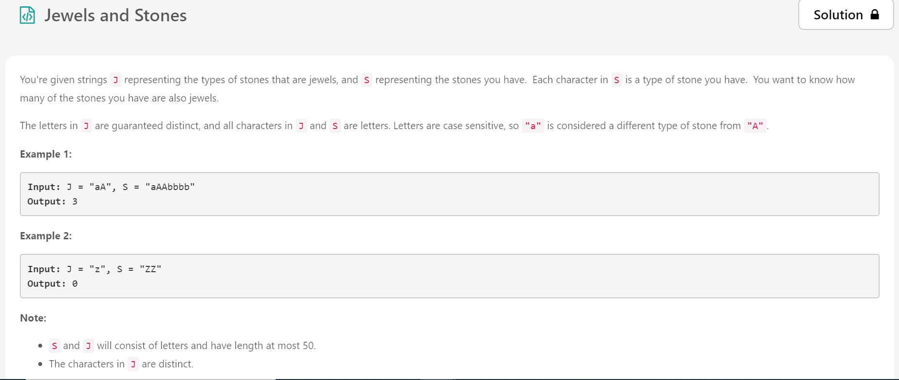

# LeetCode-May-2020
LeetCode's May Challenge of solving a problem a day

# May 1

## Approach

I have perceived the problem as a Search Technique Use Case.
A binary search tree does not store an index of its data elements. Instead, it relies on its implicit structure (left or right of each node) to keep a record of where each element is. The result is insertion and deletion at logarithmic time, or O(log n).
Therefore, I have used Binary Tree to resolve the problem.

This Approach has not provided optimal runtime(32ms)/memory usage(13.7MB).

# May 2

## Approach

I have converted both the strings into a list of characters, and returned the length of the list where characters overlap. This keeps the runtime short but the memory usage is on the higher side due to the creation of multiple lists.

This Approach has provided an runtime higher than 70.46% submissions in Python (26ms) and a memory usage on the higher end(13.6MB).
